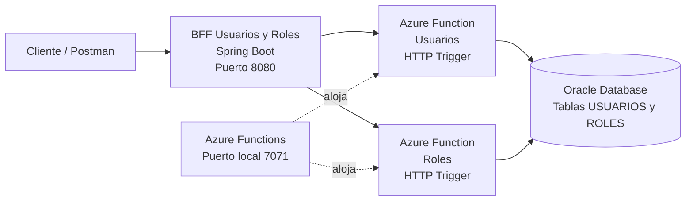

# Arquitectura - Sistema de Gestión de Usuarios y Roles

## Flujo de comunicación

1. El cliente realiza solicitudes HTTP al BFF.
2. El BFF recibe y orquesta las solicitudes.
3. El BFF consume las Azure Functions de Usuarios y Roles.
4. Las Azure Functions ejecutan las operaciones CRUD.
5. Las funciones se conectan mediante JDBC a Oracle Database.
6. Oracle almacena la información de usuarios y roles.

## Endpoints

### BFF
- `/api/usuarios`
- `/api/usuarios/{id}`
- `/api/roles`
- `/api/roles/{id}`

### Azure Functions
- `/api/usuarios`
- `/api/usuarios/{id}`
- `/api/roles`
- `/api/roles/{id}`